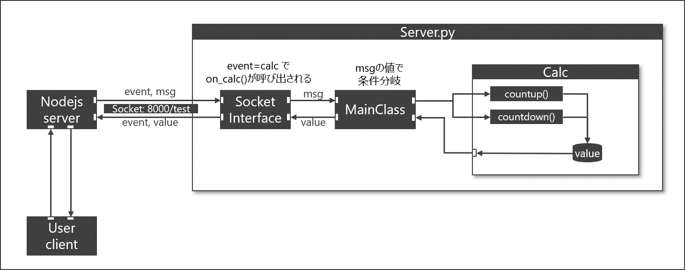

# py-node-socket-test

# Environment
- Windows 10 64bit
- Python 3.10.6
- Node.js 16.20.0

# Install requirements
## Python
    python3 -m pip install python-socketio
    python3 -m pip install eventlet

## Nodejs
    cd nodejs/
    npm install

## How To Run

Open a terminal. then,

    cd python/
    python3 server.py

Now a server is running on your local network.

And open another terminal, then,

    cd nodejs
    node app.js

Now you can access with your browser.  
Enjoy!

## Construction
